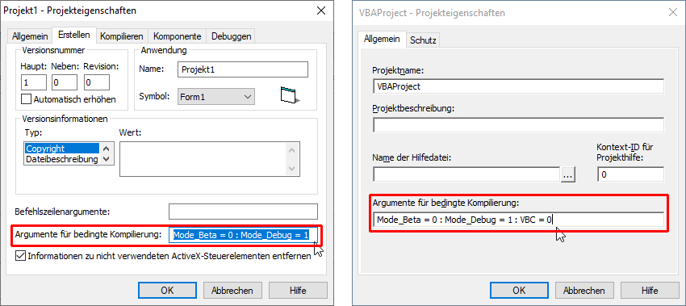

# XL_VBanywhere  
## VB-Code running in VBC as well as in VBA7-x86 and -x64  

[](https://github.com/OlimilO1402/XL_VBanywhere/blob/master/LICENSE)
[](https://github.com/OlimilO1402/XL_VBanywhere/releases/latest)
[](https://github.com/OlimilO1402/XL_VBanywhere/releases/download/v1.0.0/XL_VBanywhere.zip)
[](https://github.com/OlimilO1402/XL_VBanywhere/watchers)

Tutorial published on 04. aug. 2021. at ActiveVB.de/VBA-Forum.  
The project shows how to make VB-Code runnable in VB-Classic as well as in 64-bit VBA7, by using conditional compilation and at the same time how to avoid unecessary lines of code caused by conditional compilation just by inventing the datatype Enum LongPtr in VBC.  

Tutorial in english  

## VB-Code running in VBC as well as in VBA7-x86 and -x64  
### VB Conditional Compilation   

In the VBC-IDE in the project-properties dialog we have the tab "Compilation" (english help needed) under "Arguments for conditional compilation" we are able to define constants to control the behavior of the compiler to our own needs.  
In the VBA-IDE you will find the menu item "Extras" and "Properties for VBA Project...".  
To separate different constants, use a colon ":" e.g.:  

Mode_Beta = 0 : Mode_Debug = 1 : VBC = 1   

  

With the #If-statement-for-conditional-compilation we are able to check those constants for telling the compiler what to compile and what not to compile.  
The Compiler will only use the true line, all other code will be left out and will not be touched e.g.:  

```vba
Private Sub Form_Load()
    #If Mode_Beta Then
        InitModeBeta
    #ElseIf Mode_Debug Then
        InitModeDebug
    #Else 'every other release
        InitModeRelease
    #End If
End Sub

Private Sub InitModeBeta()
    MsgBox "Init Mode Beta"
End Sub
Private Sub InitModeDebug()
    MsgBox "Init Mode Debug"
End Sub
Private Sub InitModeRelease()
    MsgBox "Init Mode Release"
End Sub
```
  
### VBA7 x86 and x64  
Since around 2007 we have got VBA7 for the 64-Bit platform. With VBA7 microsoft invented 2 new predefined compiler-constants and a few new keywords.  

#### New Compiler-Constants in VBA7  
As mentioned above these are predefined already, what means you don't have to define them yourself, they are already there and already known to the VBA7-compiler.
The constants are:  
**Win64** and **VBA7**  

These constants were necessary, because VBA7 resp. Office itself can run either in 32-Bit-x86-mode as well as in 64-Bit-x64-mode.  

In the Office 64-Bit version with VBA7 we have:  
Win64 = 1 and VBA7 = 1  

In the Office 32-Bit version with VBA7 we have:  
Win64 = 0 and VBA7 = 1  

In all other older Office 32-Bit Versions before 2007 and in VBC, there is of course none of this and therefor the default for a non defined compiler constant is 0  
Win64 = 0 and VBA7 = 0  

#### New Keywords and Datatypes in VBA7  
In VBA7 every API-function needs the new keyword "**PtrSafe**" inserted before Function/Sub. Because VBC does not know this keyword, we are forced to declare every API-Function twice for this purpose.  
At least we are able to do this, just by using the constant "VBA7" copying the declares and insert the PtrSafe-keyword, nothing more to do here.  

In x86/Win32 every pointer has a width of 32 bits. In VBC there is no special datatype for pointers, therefore in the past the VB-community used the datatype Long for pointers, 
also because it is returned from the functions StrPtr, ObjPtr and VarPtr in VBC/VBA6.

Because in x64 every pointer has a width of 64 bits microsoft invented the new datatype "**LongPtr**" with VBA7.  

LongPtr has a very special ability: in X86 it has a width of 32 bit and in x64 it has a width of 64 bit  

*Bear in mind:*  
The datatype LongPtr must be used with all handles like hWnd or hDC as well as for pointers like e.g. with the Unicode-API-functions (the W-functions) e.g. for using unicode Strings.  
Furthermore the datytype LongPtr is returned by the functions StrPtr, ObjPtr and VarPtr in VBA7.  

### New Datatype in VBC?  
in VBC there is no new Datatype, but for our purposes we can simplify our lifes drastically by using an empty Enum with the name LongPtr.

```vba
Public Enum LongPtr
    [_]
End Enum
```

Every Enum-constant is a 32 bit integer resp VB.Long, that is of course sufficient for pointers.  
By inventing the Enum-type LongPtr we get the advantage to define every API-function in VBC and VBA7-x64 to be the same, and differing only in the keyword PtrSafe.  
Now we finally can get rid of so many conditional-compilation-lines of code like "#If VBA7 Then".  
For structurs resp ud-types for the windows-API, we get the benefit to avoid conditional compilation completely, and delete unecessary double declared ud-types, saving a lot of lines of code.  

### Further Reading ###  
[docs.microsoft: Kompatibilität zwischen der 32-Bit- und der 64-Bit-Version von Office](https://docs.microsoft.com/de-de/office/client-developer/shared/compatibility-between-the-32-bit-and-64-bit-versions-of-office)  

The GitHub-repo contains a little VBC-project with only a form and a module, and also a little excel-file Mappe1.xlsm with the identic code.  
Please pay attention to the following: in the excel-file no code will be started unless you call the makro "Main" yourself manually.  

Form/UserForm: MyForm
Label: Label1, Label2
CommandButton: Btn1

```vba
Option Explicit
Private m_hWnd As LongPtr
Private m_hDC  As LongPtr

#If VBA6 Or VBA7 Then
Private Sub UserForm_Activate()
#Else
Private Sub Form_Activate()
#End If
    Initialize
End Sub

Sub Initialize()
    m_hWnd = GetActiveWindow
    m_hDC = GetDC(m_hWnd)
    Label1.Caption = "hWnd: " & m_hWnd & " = &H" & Hex(m_hWnd)
    Label2.Caption = "hDC:  " & m_hDC & " = &H" & Hex(m_hDC)
End Sub

Private Sub Btn1_Click()
    
    Dim hr As Long
    Dim r As RECT: r = New_RECT(Btn1.Left, Btn1.Top + Btn1.Height + 30, 400, 40)
    hr = DrawFocusRect(m_hDC, r)
    
    Dim ga As String: ga = GetGreekAlphabet
    MsgBox ga
    MsgBoxW ga
    
    hr = DrawTextW(m_hDC, StrPtr(ga), Len(ga), r, DT_CENTER Or DT_VCENTER Or DT_SINGLELINE)
    
End Sub
```

Modul: Module1

```vba
Option Explicit

Public Type RECT
    Left   As Long
    Top    As Long
    Right  As Long
    Bottom As Long
End Type

Public Const DT_CENTER     As Long = &H1
Public Const DT_VCENTER    As Long = &H4
Public Const DT_SINGLELINE As Long = &H20

#If VBA7 Then
    Public Declare PtrSafe Function GetActiveWindow Lib "user32" () As LongPtr
    Public Declare PtrSafe Function GetDC Lib "user32" (ByVal hWnd As LongPtr) As LongPtr
    Public Declare PtrSafe Function DrawTextW Lib "user32" (ByVal hdc As LongPtr, ByVal lpStr As LongPtr, ByVal nCount As Long, ByRef lpRect As RECT, ByVal wFormat As Long) As Long
    Public Declare PtrSafe Function DrawFocusRect Lib "user32" (ByVal hDC As LongPtr, ByRef lpRect As RECT) As Long
    Public Declare PtrSafe Function MessageBoxW Lib "user32" (ByVal hwnd As LongPtr, ByVal lpText As LongPtr, ByVal lpCaption As LongPtr, ByVal wType As Long) As Long
#Else
    Public Enum LongPtr
        [_]
    End Enum
    Public Declare Function GetActiveWindow Lib "user32" () As LongPtr
    Public Declare Function GetDC Lib "user32" (ByVal hwnd As LongPtr) As LongPtr
    Public Declare Function DrawTextW Lib "user32" (ByVal hDC As LongPtr, ByVal lpStr As LongPtr, ByVal nCount As Long, ByRef lpRect As RECT, ByVal wFormat As Long) As Long
    Public Declare Function DrawFocusRect Lib "user32" (ByVal hDC As LongPtr, ByRef lpRect As RECT) As Long
    Public Declare Function MessageBoxW Lib "user32" (ByVal hwnd As LongPtr, ByVal lpText As LongPtr, ByVal lpCaption As LongPtr, ByVal wType As Long) As Long
#End If

Sub Main()
    #If Mode_Beta Then
        InitModeBeta
    #ElseIf Mode_Debug Then
        InitModeDebug
    #Else 'every other release
        InitModeRelease
    #End If
    MyForm.Show
End Sub

Private Sub InitModeBeta()
    MsgBox "Init Mode Beta"
End Sub

Private Sub InitModeDebug()
    MsgBox "Init Mode Debug"
End Sub

Private Sub InitModeRelease()
    MsgBox "Init Mode Release"
End Sub

Function New_RECT(ByVal Left As Long, ByVal Top As Long, ByVal Width As Long, ByVal Height As Long) As RECT
    New_RECT.Left = Left
    New_RECT.Right = Left + Width
    New_RECT.Top = Top
    New_RECT.Bottom = Top + Height
End Function

Property Get App_EXEName() As String
#If VBA6 Or VBA7 Then
    App_EXEName = Application.Name
#Else
    App_EXEName = App.EXEName
#End If
End Property

Function GetGreekAlphabet() As String
    Dim s As String
    Dim i As Long
    Dim alp As Long: alp = 913 'the upper greek letter Alpha
    For i = alp To alp + 24
        s = s & ChrW(i)
    Next
    s = s & " "
    alp = alp + 32             'the lower greek letter alpha
    For i = alp To alp + 24
        s = s & ChrW(i)
    Next
    GetGreekAlphabet = s
End Function

Public Function MsgBoxW(Prompt, Optional ByVal Buttons As VbMsgBoxStyle = vbOKOnly, Optional ByVal Title) As VbMsgBoxResult
    Title = IIf(IsMissing(Title), App_EXEName, CStr(Title))
    MsgBoxW = MessageBoxW(0, StrPtr(Prompt), StrPtr(Title), Buttons)
End Function
```