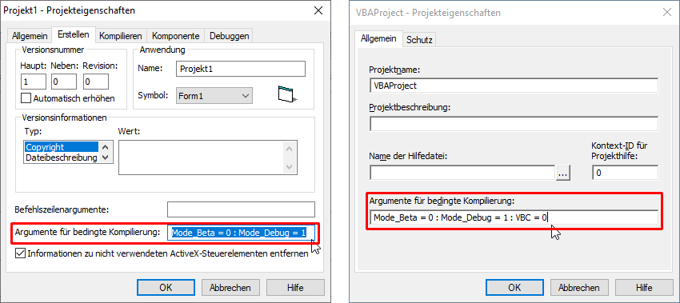

# XL_VBanywhere  
## VB-Code running in VBC as well as in VBA7-x86 and -x64  

[](https://github.com/OlimilO1402/XL_VBanywhere/blob/master/LICENSE)
[](https://github.com/OlimilO1402/XL_VBanywhere/releases/latest)
[](https://github.com/OlimilO1402/XL_VBanywhere/releases/download/v1.0.0/XL_VBanywhere.zip)
[](https://github.com/OlimilO1402/XL_VBanywhere/watchers)

Tutorial published on 04. aug. 2021. at ActiveVB.de/VBA-Forum
Das GitHub-Repo enthält ein kleines VB-Projekt mit einer Form und einem Modul, und eine Exceldatei Mappe1.xlsm mit identischem Code. Bitte beachten Sie, in der Excel-datei wird kein Code gestartet, erst durch manuelles Aufrufen des Makros "Main". Es soll gezeigt werden wie VB-Code in VB-Classic als auch in VBA7-x64 lauffähig wird, durch bedingte Kompilierung und durch Einführung des Datentyp Enum LongPtr in VBC.

Tutorial in german, deutsch

## VB-Code lauffähig in VBC als auch VBA7-x86 und -x64  
### VB bedingte Kompilierung   

In der VBC-IDE gibt es in den Projekteigenschaften unter "Erstellen" "Argumente für bedingte Kompilierung" die Möglichkeit Konstanten zu definieren, mit denen das Verhalten des Compilers nach Belieben gesteuert werden kann.
Ebenso in der VBA-IDE zu finden unter "Extras" "Eigenschaften von VBAProjekt..."  
Mehrere Konstanten werden mit einem Doppelpunkt ":" voneinander getrennt z.B.:  

Mode_Beta = 0 : Mode_Debug = 1 : VBC = 1  

  

Zusätzlich kann man mit dem #If-Statement-für-bedingte-Kompilierung diese Konstanten abfragen um dem Compiler zu sagen was er Kompilieren soll und was er beim Kompilieren weglassen soll. z.B.:

```vba
Private Sub Form_Load()
    #If Mode_Beta Then
        InitModeBeta
    #ElseIf Mode_Debug Then
        InitModeDebug
    #Else 'every other release
        InitModeRelease
    #End If
End Sub

Private Sub InitModeBeta()
    MsgBox "Init Mode Beta"
End Sub
Private Sub InitModeDebug()
    MsgBox "Init Mode Debug"
End Sub
Private Sub InitModeRelease()
    MsgBox "Init Mode Release"
End Sub
```
  
### VBA7 x86 und x64  
Seit ca 2007 gibt es VBA7 auch für die 64-Bit Plattform. Mit VBA7 wurden 2 neue vorbelegte Kompiler-Konstanten und neue Schlüsselwörter eingeführt.  

#### Neue Kompiler-Konstanten in VBA7  
Diese sind wie gesagt bereits vorbelegt, d.h. sie müssen nirgends angelegt werden, sondern die kennt der Kompiler bereits.
Die Konstanten sind:  
Win64 und VBA7  
Diese Konstanten wurden erforderlich, da es VBA7 bzw Office sowohl in der 32-Bit-x86-Version als auch in der 64-Bit-x64-Version gibt.  
In der Office 64-Bit Version ist  
Win64 = 1 und VBA7 = 1  
In der Office 32-Bit Version mit VBA7 ist  
Win64 = 0 und VBA7 = 1  
In älteren Office 32-Bit Versionen vor 2007 und in VBC ist  
Win64 = 0 und VBA7 = 0  

#### Neue Schlüsselwörter und Datentypen in VBA7  
Jede API-Funktion braucht im Vergleich zu VBC/VBA6 das zusätzliche Schlüsselwort "**PtrSafe**" das vor Function/Sub eingefügt wird. Da VBC dieses Schlüsselwort nicht kennt kommen wir für unseren Zweck nicht umhin Jede API-Funktion mit Hilfe der bedingten Kompilierung zweimal zu deklarieren.  

In x86/Win32 sind alle Zeiger 32 Bit breit. Da es in VBC keinen eigenen speziellen Datentyp für Zeiger gibt, hat sich der Datentyp Long eingebürgert. Der Datentyp Long ist außerdem der Datentyp der von den Funktionen StrPtr, ObjPtr und VarPtr in VBC zurückgegeben wird.
Weil unter x64 alle Zeiger 64 bit breit sind wurde in VBA7 der Datentyp "**LongPtr**" eingeführt.  

*Merke:*
Der Datentyp LongPtr muss bei allen Handles wie hWnd oder hDC als auch bei Zeiger wie z.B. bei den Unicode-API-Funktionen (W-Funktionen) für z.B. String verwendet werden. Der Datentyp LongPtr ist außerdem der Datentyp der von den Funktionen StrPtr, ObjPtr und VarPtr in VBA7 zurückgegeben wird.  

### Neuer Datentpy in VBC?  
in VBC gibt es keinen neuen Datentyp, wir können uns allerdings behelfen indem wir einen Enum mit dem Namen LongPtr einführen.

```vba
Public Enum LongPtr
    [_]
End Enum
```

Jede Enum-Konstante ist ein 32-Bit breiter Integer bzw ein VB.Long, für Zeiger also ausreichend.
Die Einführung des Enum-Typen LongPtr hat den Vorteil dass sich API-Funtkionen zwischen VBC und VBA7-64 nur noch durch das Schlüsselwort PtrSafe unterscheiden, und ansonsten genau gleich lauten.
Für Strukturen bzw ud-Types die für die Windows-API verwendet werden müssen, hat dies sogar den Vorteil dass sie nicht durch bedingte Kompilierung doppelt angelegt werden müssen, man spart also jede Menge Platz, Zeilen und Schreibarbeit.

### Links ###   
[docs.microsoft: Kompatibilität zwischen der 32-Bit- und der 64-Bit-Version von Office](https://docs.microsoft.com/de-de/office/client-developer/shared/compatibility-between-the-32-bit-and-64-bit-versions-of-office)  


Form/UserForm: MyForm
Label: Label1, Label2
CommandButton: Btn1

```vba
Option Explicit
Private m_hWnd As LongPtr
Private m_hDC  As LongPtr

#If VBA6 Or VBA7 Then
Private Sub UserForm_Activate()
#Else
Private Sub Form_Activate()
#End If
    Initialize
End Sub

Sub Initialize()
    m_hWnd = GetActiveWindow
    m_hDC = GetDC(m_hWnd)
    Label1.Caption = "hWnd: " & m_hWnd & " = &H" & Hex(m_hWnd)
    Label2.Caption = "hDC:  " & m_hDC & " = &H" & Hex(m_hDC)
End Sub

Private Sub Btn1_Click()
    
    Dim hr As Long
    Dim r As RECT: r = New_RECT(Btn1.Left, Btn1.Top + Btn1.Height + 30, 400, 40)
    hr = DrawFocusRect(m_hDC, r)
    
    Dim ga As String: ga = GetGreekAlphabet
    MsgBox ga
    MsgBoxW ga
    
    hr = DrawTextW(m_hDC, StrPtr(ga), Len(ga), r, DT_CENTER Or DT_VCENTER Or DT_SINGLELINE)
    
End Sub
```

Modul: Module1

```vba
Option Explicit

Public Type RECT
    Left   As Long
    Top    As Long
    Right  As Long
    Bottom As Long
End Type

Public Const DT_CENTER     As Long = &H1
Public Const DT_VCENTER    As Long = &H4
Public Const DT_SINGLELINE As Long = &H20

#If VBA7 Then
    Public Declare PtrSafe Function GetActiveWindow Lib "user32" () As LongPtr
    Public Declare PtrSafe Function GetDC Lib "user32" (ByVal hWnd As LongPtr) As LongPtr
    Public Declare PtrSafe Function DrawTextW Lib "user32" (ByVal hdc As LongPtr, ByVal lpStr As LongPtr, ByVal nCount As Long, ByRef lpRect As RECT, ByVal wFormat As Long) As Long
    Public Declare PtrSafe Function DrawFocusRect Lib "user32.dll" (ByVal hDC As LongPtr, ByRef lpRect As RECT) As Long
    Public Declare PtrSafe Function MessageBoxW Lib "user32" (ByVal hwnd As LongPtr, ByVal lpText As LongPtr, ByVal lpCaption As LongPtr, ByVal wType As Long) As Long
#Else
    Public Enum LongPtr
        [_]
    End Enum
    Public Declare Function GetActiveWindow Lib "user32" () As LongPtr
    Public Declare Function GetDC Lib "user32" (ByVal hwnd As LongPtr) As LongPtr
    Public Declare Function DrawTextW Lib "user32" (ByVal hDC As LongPtr, ByVal lpStr As LongPtr, ByVal nCount As Long, ByRef lpRect As RECT, ByVal wFormat As Long) As Long
    Public Declare Function DrawFocusRect Lib "user32.dll" (ByVal hDC As LongPtr, ByRef lpRect As RECT) As Long
    Public Declare Function MessageBoxW Lib "user32" (ByVal hwnd As LongPtr, ByVal lpText As LongPtr, ByVal lpCaption As LongPtr, ByVal wType As Long) As Long
#End If

Sub Main()
    #If Mode_Beta Then
        InitModeBeta
    #ElseIf Mode_Debug Then
        InitModeDebug
    #Else 'every other release
        InitModeRelease
    #End If
    MyForm.Show
End Sub

Private Sub InitModeBeta()
    MsgBox "Init Mode Beta"
End Sub

Private Sub InitModeDebug()
    MsgBox "Init Mode Debug"
End Sub

Private Sub InitModeRelease()
    MsgBox "Init Mode Release"
End Sub

Function New_RECT(ByVal Left As Long, ByVal Top As Long, ByVal Width As Long, ByVal Height As Long) As RECT
    New_RECT.Left = Left
    New_RECT.Right = Left + Width
    New_RECT.Top = Top
    New_RECT.Bottom = Top + Height
End Function

Property Get App_EXEName() As String
#If VBA6 Or VBA7 Then
    App_EXEName = Application.Name
#Else
    App_EXEName = App.EXEName
#End If
End Property

Function GetGreekAlphabet() As String
    Dim s As String
    Dim i As Long
    Dim alp As Long: alp = 913 'der Große griechische Buchstabe Alpha
    For i = alp To alp + 24
        s = s & ChrW(i)
    Next
    s = s & " "
    alp = alp + 32             'der Kleine griechische Buchstabe alpha
    For i = alp To alp + 24
        s = s & ChrW(i)
    Next
    GetGreekAlphabet = s
End Function

Public Function MsgBoxW(Prompt, Optional ByVal Buttons As VbMsgBoxStyle = vbOKOnly, Optional ByVal Title) As VbMsgBoxResult
'Public Function MsgBoxW(Prompt, Optional ByVal Buttons As VbMsgBoxStyle = vbOKOnly, Optional ByVal Title, Optional Helpfile, Optional Context) As VbMsgBoxResult
    Title = IIf(IsMissing(Title), App_EXEName, CStr(Title))
    MsgBoxW = MessageBoxW(0, StrPtr(Prompt), StrPtr(Title), Buttons)
End Function
```